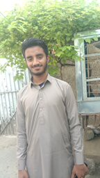
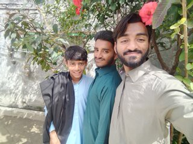
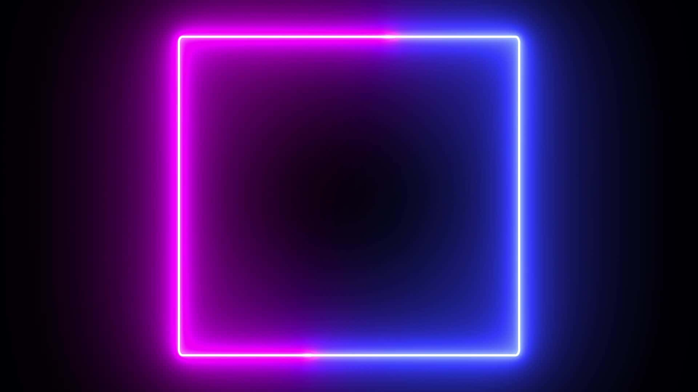
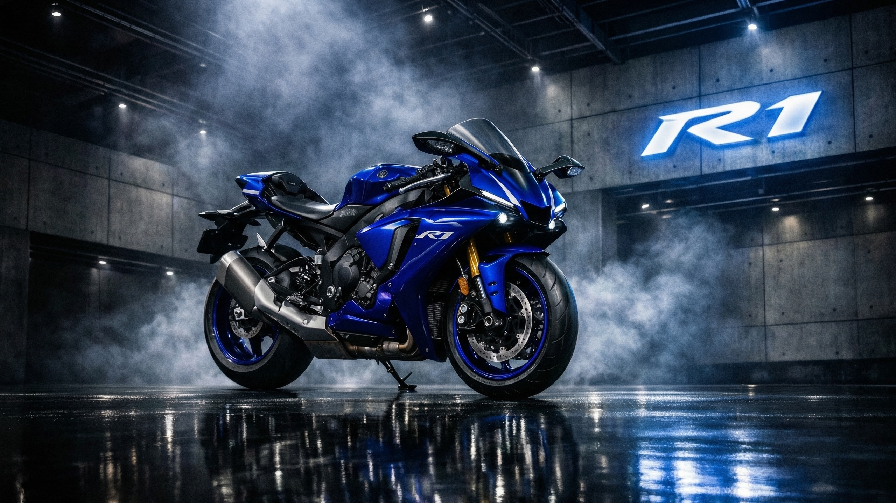

# Python-Notes-From-Bsics-to-advance


## Here we starting the codes of python with outputs:


# ADAPTIVE THRESHOLDING:


**We use it because simple thresholding is not able to handl.**


**differrent type of low luminous pixels.**


**this is algorithm calculate the threshold for a small regions in same image.**


**so we get multiple threshold for diff regions in same image.**


**Adaptive methode: it decides how thresholding value is calculated.** 


***cv2.ADAPTIVE_THRESH_MEAN_C :
cv2.ADAPTIVE_THRESH_GAUSSIAN_C :
threshold(img,pixels_thresh,_max_thresh_pixel,method,style,no._of_pixel,contact_mean)***


***lets start:***


**Theory:**


Adaptive thresholding is an image processing technique used to convert a grayscale image into


a binary image by calculating different threshold values for different regions of the image instead of using one global value.


It’s widely used in computer vision tasks like text detection, pedestrian detection, and object segmentation.


**Basic Idea:**


In normal (global) thresholding:


One single threshold value is applied to the entire image.


In adaptive thresholding:


The threshold is computed locally for each pixel using nearby pixels.


This works better when lighting is uneven.


**Why Adaptive Threshold is Needed?**


Adaptive thresholding is useful when:


Lighting is not uniform
Shadows exist
Background brightness changes
Objects are partially illuminated


Global threshold fails in these cases, but adaptive threshold works well.


**Mathematical Theory:**


For each pixel (x, y):


Binary image is computed as:


if I(x,y) > T(x,y) → pixel = 255


else → pixel = 0


I(x,y) = pixel intensity


T(x,y) = local threshold calculated from neighborhood


**Two Common Methods:**


***1. Mean Adaptive Threshold:***


Threshold is the mean of neighboring pixels:


T(x,y) = mean(neighborhood) − C


neighborhood = block around pixel


C = constant (tuning value)


***2. Gaussian Adaptive Threshold:***


Threshold is weighted sum (Gaussian) of neighbors:


T(x,y) = gaussian_weighted_sum − C


This gives more importance to nearby pixels.


**Advantages:**


Works with uneven lighting


Better edge detection


Good for real-world images


Useful for pedestrian detection preprocessing


**Disadvantages:**


Slower than global threshold


Needs parameter tuning (block size, C)


Sensitive to noise


**Example Use Cases:**


Document text extraction


License plate detection


Pedestrian silhouette detection


Medical image segmentation


***CODE SAMPLE:***

```Python Code:


import cv2
import numpy as np

img = cv2.imread(r"A:\computer_Vision\534.jpg", cv2.IMREAD_GRAYSCALE)

th1 = cv2.threshold(img, 127, 255, cv2.THRESH_BINARY)[1]

th2 = cv2.adaptiveThreshold(
    img,
    255,
    cv2.ADAPTIVE_THRESH_MEAN_C,
    cv2.THRESH_BINARY,
    11,
    2
)

th3 = cv2.adaptiveThreshold(
    img,
    255,
    cv2.ADAPTIVE_THRESH_GAUSSIAN_C,
    cv2.THRESH_BINARY,
    11,
    2
)


cv2.imshow("image", img)
cv2.imshow("THRESH_BINARY", th1)
cv2.imshow("adaptive 1==", th2)
cv2.imshow("adaptive 2==", th3)


cv2.waitKey(0)
cv2.destroyAllWindows()
```


**THIS IS THE OUTPUT IMAGE:**


**Drawing Shapes and Text Using OpenCV in Python:**


***This program demonstrates how to draw geometric shapes and text on an image using the OpenCV library in Python. OpenCV provides built-in functions to draw primitives such as rectangles, circles, lines, arrows, ellipses, and text. These drawing operations are commonly used in computer vision for annotation, object detection visualization, and debugging.
The program first imports NumPy and OpenCV, which are required for image creation and manipulation.***


**codes intro:**


import numpy as np
import cv2

*NumPy is used to create blank images, while OpenCV functions are used to draw shapes.*


***1. Reading an Image:***


**img = cv2.imread("A:/computer_Vision/602.jpg")**


**This function loads an image from disk into memory. The image is stored as a NumPy array where:
Height × Width × Channels
Channels represent BGR color format (Blue, Green, Red):**


**2. Drawing Rectangle:**


**cv2.rectangle(img, (50, 50), (200, 200), (0, 255, 0), -2)**


***Rectangle is drawn using:***


***Start point → (50, 50)
End point → (200, 200)
Color → (0,255,0) → Green
Thickness → -2 (filled rectangle)***


**The upper function is useful for bounding boxes in object detection.**


**3. Drawing Circle:**


**cv2.circle(img, (200, 200), 50, (255, 0, 0), -2)**


***Parameters:***


**Center → (200,200)
Radius → 50
Color → Blue (BGR format)
Thickness → -2 (filled circle
Circles are used for feature visualization and tracking points.**


**4. Drawing Line:**


**cv2.line(img, (0, 0), (200, 200), (0, 0, 255), 2)**


***Draws a line:***

***Start → top-left corner
End → (200,200)
Color → Red
Thickness → 2 pixels***

Lines are used for trajectory visualization.

**5. Arrowed Line:**


**img = cv2.arrowedLine(img, (0, 125), (255, 255), (255, 0, 125), 3)**

**This draws a directional arrow. It is commonly used to:**

**Show motion direction
Indicate object movement
Visualize vectors**


**6. Putting Text:**


**img = cv2.putText(img, "MR.SHAMEER", (20, img.shape[0]-20),
                  cv2.FONT_HERSHEY_SCRIPT_SIMPLEX, 1,
                  (0,125,255), 2, cv2.LINE_AA)**

**This upper function writes text on image:**


**Text → "MR.SHAMEER"
Position → bottom-left
Font → Script style
Font size → 1
Color → orange-like
Thickness → 2
LINE_AA → smooth text.**

**Used for:**

**labeling objects
watermarking
displaying info**


**7. Drawing Ellipse:**


**img = cv2.ellipse(img, (200, 200), (100, 50), 70, 70, 500, (155, 155, 155), -5)**


***Ellipse parameters:***


***Center → (200,200)
Axis lengths → (100,50)
Rotation → 70 degrees
Start angle → 70
End angle → 500
Color → gray
Thickness → filled
Ellipse is useful for object contour approximation.***


**Creating Blank Image (Black)**


**img = np.zeros([512, 512, 3], np.uint8)*255**


**This Function Creates black image:**


**Size → 512 × 512
3 channels → color image
zeros → black background**


**9. Creating Blank Image (White)**


**img = np.ones([512, 512, 3], np.uint8)*255**


***This Code Has Creates white image:***


**ones × 255 → white background
Used for drawing shapes on blank canvas**


***THIS IS THE DISPLAY SIDE:***


**10. Displaying Image:**


cv2.imshow("Image", img)


***THIS IS THE LAST AND IMPORTTANT LINES OF EVERY CODE:***


cv2.waitKey(0)
cv2.destroyAllWindows()

***These functions:***

**Show image window
Wait for key press
Close all windows**


**THIS IS THE FULL CODE:**


```Python Code:


import numpy as np
import cv2

# Read image (make sure file has extension like .jpg or .png.)
img = cv2.imread("A:/computer_Vision/602.jpg")

# Draw a rectangle.
cv2.rectangle(img, (50, 50), (200, 200), (0, 255, 0), -2)

# Draw a circle.
cv2.circle(img, (200, 200), 50, (255, 0, 0), -2)

# Draw a line.
cv2.line(img, (0, 0), (200, 200), (0, 0, 255), 2)

# DRAWING ARROWED LINE.
img = cv2.arrowedLine(img, (0, 125), (255, 255), (255, 0, 125), 3)

# Put text.
img = cv2.putText(img, "MR.SHAMEER", (20, img.shape[0]-20),
                  cv2.FONT_HERSHEY_SCRIPT_SIMPLEX, 1,
                  (0,125,255), 2, cv2.LINE_AA)

img = cv2.ellipse(img, (200, 200), (100, 50), 70, 70, 500, (155, 155, 155), -5)

#FOR FULL BLACK SCREEN.
# img = np.zeros([512, 512, 3], np.uint8)*255

# FOR FULL WHITE SCREEN.
img = np.ones([512, 512, 3], np.uint8)*255

# Show image.
cv2.imshow("Image", img)
cv2.waitKey(0)
cv2.destroyAllWindows()
```


**THIS IS THE OUTPUT IMAGE:**


**Background Removal Using Histogram Back Projection in OpenCV:**


***This program demonstrates background removal using HSV color space, ROI histogram, and back projection. The goal is to extract objects that have similar color distribution as the selected ROI (Region of Interest) and remove the rest of the background.
This technique is widely used in object tracking, segmentation, and foreground extraction.***


**1. Importing Libraries:**


**import cv2
import numpy as np**


**OpenCV (cv2) is used for image processing
NumPy is used for matrix operations.**


**2. Reading the Image:**


**img = cv2.imread(r"A:\computer_Vision\920.jpg")
This loads the original image from disk. The image is stored in BGR color format.**


**3. Resizing the Image:**


**img = cv2.resize(img, (400, 400))**


***The image is resized to:
Width = 400
Height = 400
Resizing ensures consistent processing speed and reduces computation.***


**4. Converting Image to HSV:**


**hsv_original = cv2.cvtColor(img, cv2.COLOR_BGR2HSV)**


***The image is converted from BGR to HSV color space.
HSV is preferred because:
Hue represents color
Saturation represents purity
Value represents brightness
HSV makes color-based segmentation more robust than RGB.***

**5. Creating Region of Interest (ROI):**


**roi = cv2.imread(r"A:\computer_Vision\bgr.jpg")
roi = cv2.resize(roi, (100, 100))
hsv_roi = cv2.cvtColor(roi, cv2.COLOR_BGR2HSV)**


**ROI is a small image containing the object color to be extracted.
This ROI acts as a reference for background removal.
Steps:
Load ROI image
Resize ROI
Convert ROI to HSV**


**6. Creating Histogram of ROI:**


**roi_hist = cv2.calcHist([hsv_roi], [0, 1], None, [180, 256],
                        [0, 180, 0, 256])**


***This calculates a 2D histogram using:
Channel 0 → Hue
Channel 1 → Saturation
The histogram represents color distribution of the object.***


**7. Normalizing Histogram:**


**cv2.normalize(roi_hist, roi_hist, 0, 255, cv2.NORM_MINMAX)**


***Histogram normalization:
Scales values between 0 and 255
Improves detection accuracy
Makes matching more stable
This step is important for better segmentation.***


**8. Back Projection:**


**mask = cv2.calcBackProject([hsv_original], [0, 1], roi_hist,
                           [0, 180, 0, 256], 1)**
                           

**Back projection finds pixels in original image that match ROI colors.**


**Output:**


***Bright pixels → match ROI
Dark pixels → background
This produces a probability mask.***


**9. Noise Filtering:**


**kernel = cv2.getStructuringElement(cv2.MORPH_ELLIPSE, (5, 5))
mask = cv2.filter2D(mask, -1, kernel)**


**Filtering:**


**Removes small noise
Smooths mask
Improves segmentation
Elliptical kernel preserves object shape.**


**10. Binary Thresholding:**


**_, mask = cv2.threshold(mask, 200, 255, cv2.THRESH_BINARY)**


***Threshold converts mask to binary image:
White → objectBlack → background
This step removes weak matches.***


**11. Merging Mask Channels:**


**mask_3ch = cv2.merge([mask, mask, mask])**


***The mask is converted from:
1 channel → 3 channel
This is required for bitwise operation.***


**12. Removing Background:**


**result = cv2.bitwise_and(img, mask_3ch)**


***Bitwise AND keeps:
Object pixels → preserved
Background pixels → removed
This produces the final foreground image.***


**13. Displaying Results:**


**cv2.imshow("ORIGINAL IMAGE (BGR):", img)
cv2.imshow("HSV ORIGINAL IMAGE:", hsv_original)
cv2.imshow("ROI IMAGE (BGR):", roi)
cv2.imshow("HSV ROI IMAGE:", hsv_roi)
cv2.imshow("MASK IMAGE", mask)
cv2.imshow("RESULT IMAGE", result)**


**Displays:**


***Original image
HSV image
ROI image
HSV ROI
Mask image
Final result
Conclusion***

*This program removes background using HSV histogram back projection. The ROI histogram is used to detect similar colors in the original image, and thresholding creates a mask that isolates the foreground object. This method is effective for color-based object extraction and tracking.*


**THIS IS THE FULL CODE:**


```Python:


            Removing the back ground in image


import cv2
import numpy as np

# READING THE IMAGE):-
img = cv2.imread(r"A:\computer_Vision\920.jpg")

# RESIZING THE IMAGE):-
img = cv2.resize(img, (400, 400))

# CONVERTING THE IMAGE INTO HSV):-
hsv_original = cv2.cvtColor(img, cv2.COLOR_BGR2HSV)

# CREATING THE ROI):-
roi = cv2.imread(r"A:\computer_Vision\bgr.jpg")
roi = cv2.resize(roi, (100, 100))
hsv_roi = cv2.cvtColor(roi, cv2.COLOR_BGR2HSV)

# CREATING THE HISTOGRAM ROI):-
roi_hist = cv2.calcHist([hsv_roi], [0, 1], None, [180, 256],
                        [0, 180, 0, 256])

# NORMALIZE HISTOGRAM (IMPORTANT for better result)
cv2.normalize(roi_hist, roi_hist, 0, 255, cv2.NORM_MINMAX)

mask = cv2.calcBackProject([hsv_original], [0, 1], roi_hist,
                           [0, 180, 0, 256], 1)

# FILTERING AND REMOVING THE NOISE):-
kernel = cv2.getStructuringElement(cv2.MORPH_ELLIPSE, (5, 5))
mask = cv2.filter2D(mask, -1, kernel)

_, mask = cv2.threshold(mask, 200, 255, cv2.THRESH_BINARY)

# MERGING THE IMAGES):-
mask_3ch = cv2.merge([mask, mask, mask])
result = cv2.bitwise_and(img, mask_3ch)

# -----:(DISPLAY SIDE):-----

cv2.imshow("ORIGINAL IMAGE (BGR):", img)
cv2.imshow("HSV ORIGINAL IMAGE:", hsv_original)

cv2.imshow("ROI IMAGE (BGR):", roi)
cv2.imshow("HSV ROI IMAGE:", hsv_roi)

cv2.imshow("MASK IMAGE", mask)
cv2.imshow("RESULT IMAGE", result)

cv2.waitKey(0)
cv2.destroyAllWindows()
 
```


**THIS IS THE OUTPUT IMAGE:**





**CODE NO 4-) WITH THEORY:**


**Bitwise Operations in OpenCV (AND, OR, NOT, XOR):**


***Operations includes AND, OR, NOT, XOR.
It is more important and used for various purposes like making
and finding ROI (Region of Interest)***


***This program demonstrates bitwise operations in OpenCV. Bitwise operations are used to manipulate images at the pixel level. These operations are very important in image masking, background removal, and Region of Interest (ROI) extraction.
The basic bitwise operations used in image processing are:
AND
OR
NOT
XOR***


**1. Importing Libraries:**


***import cv2
import numpy as np
OpenCV (cv2) is used for image processing
NumPy is used to create blank images***


**2. Creating Blank Images:**


**img1 = np.zeros((250, 500, 3), np.uint8)
img2 = np.zeros((250, 500, 3), np.uint8)**


**Two black images are created:**


***Height = 250 pixels
Width = 500 pixels
Channels = 3 (color image)
np.zeros() creates completely black images.***


**3. Drawing Rectangles:**


**img1 = cv2.rectangle(img1, (150, 100), (200, 250), (255, 255, 255), -1)
img2 = cv2.rectangle(img2, (10, 10), (170, 190), (255, 255, 255), -1)**


**Two white rectangles are drawn:**

***White color → (255,255,255)
Thickness → -1 (filled)
These rectangles act as binary shapes for bitwise operations.***


**4. Displaying Images:**


**cv2.imshow("img1", img1)
cv2.imshow("img2", img2)**


***Displays both images before applying operations.
Bitwise Operations
Bitwise operations compare pixel values of two images.
White = 255
Black = 0***


**5. Bitwise AND Operation:**


**bitAnd = cv2.bitwise_and(img1,img2)**


***White + White → White
White + Black → Black
Black + White → Black
Black + Black → Black***


**Result:**


**Only overlapping region remains white.**


**Used for:**


***extracting common area
masking
ROI extraction***


**6. Bitwise OR Operation:**


**bitOr = cv2.bitwise_or(img1,img2)**


***White + White → White
White + Black → White
Black + White → White
Black + Black → Black***


**Combined shapes appear.**


**merging masks
combining objects**


**7. Bitwise NOT Operation:**


**bitNot1 = cv2.bitwise_not(img1)
bitNot2 = cv2.bitwise_not(img2)**


**White → Black
Black → White**


*Image colors are inverted.*


**background inversion
mask reversal**


**8. Bitwise XOR Operation:**


**bitXor = cv2.bitwise_xor(img1, img2)**


**White + White → Black
White + Black → White
Black + White → White
Black + Black → Black**


**Only non-overlapping areas remain white.
This removes the common region and keeps different parts.**


**9. Displaying XOR Result:**


**cv2.imshow('bitXor', bitXor)**


*Shows XOR output image.*


**10. Closing Windows**


**cv2.waitKey(0)
cv2.destroyAllWindows()
waitKey(0) waits for key press
destroyAllWindows() closes windows**


***This program demonstrates how bitwise operations work on binary images. These operations are essential in computer vision for masking, ROI extraction, object segmentation, and image blending***


```Python Code:


import cv2
import numpy as np

# create blank images
img1 = np.zeros((250, 500, 3), np.uint8)
img2 = np.zeros((250, 500, 3), np.uint8)

# draw rectangles
img1 = cv2.rectangle(img1, (150, 100), (200, 250), (255, 255, 255), -1)
img2 = cv2.rectangle(img2, (10, 10), (170, 190), (255, 255, 255), -1)

# show images
cv2.imshow("img1", img1)
cv2.imshow("img2", img2)

# bitAnd operation

# bitAnd = cv2.bitwise_and(img1,img2)

# cv2.imshow('bitAnd',bitAnd)


# OR operation

# bitOr = cv2.bitwise_or(img1,img2)
# cv2.imshow('bitOr',bitOr)

# NOT operation

# bitNot1 = cv2.bitwise_not(img1)
# bitNot2 = cv2.bitwise_not(img2)

# cv2.imshow('bitNot1',bitNot1)
# cv2.imshow('bitNot2',bitNot2)

# XOR operation
bitXor = cv2.bitwise_xor(img1, img2)
cv2.imshow('bitXor', bitXor)


cv2.waitKey(0)
cv2.destroyAllWindows()
```


***THIS UPPER CODE HAS NO USES THE ANY TYPE OF IMAGE***


***Theory: Canny Edge Detection Using OpenCV (Two Methods)***


# Cannye edge detection using open cv


 **Canny edge detection is a popular edge detection approach.
 It is use multi-stage algorithm to detect a edge.
 It was developed by Jhon f. Canny in 1986.
 This approach combine with 5 steps.**

 
 *Step No1 Noise reduction (gauss,2) and (Gradient clacilation).*
 
 
 *Step No 2 None maximum supperson,4) and (Double Threshold).*
 
 
 *Step No3 Edge tracking by Hystresis.*


***This program demonstrates Canny Edge Detection using OpenCV. Canny edge detection is a widely used algorithm for detecting edges in an image. It detects sharp intensity changes and highlights object boundaries.
The algorithm was developed by John F. Canny (1986) and works using a multi-stage process.
Canny Edge Detection Steps***


**The Canny algorithm consists of the following stages:**


***1. Noise Reduction:***


**Gaussian filter is applied
Removes noise from image
Prevents false edges.**


**2. Gradient Calculation:**


**Finds intensity change in image
Detects strong edges
Uses Sobel operators**


**3. Non-Maximum Suppression:**


**Removes unwanted thick edges
Keeps only thin edge lines**


**4. Double Threshold:**


**Uses two thresholds:
Low threshold
High threshold
Classifies edges as:
Strong edges
Weak edges
Non edges**


**5. Edge Tracking by Hysteresis:**


***Weak edges connected to strong edges are kept
Others are removed
This produces clean and accurate edge detection.***


**Method 1: Static Threshold Canny Edge Detection:**


**img = cv2.imread(r"A:\computer_Vision\43.jpg")
img = cv2.resize(img, (250, 250))
img_gray = cv2.cvtColor(img, cv2.COLOR_BGR2GRAY)
canny = cv2.Canny(img_gray, 50, 150)**


***Image is loaded and resized
Converted to grayscale
Canny edge detection applied with:
Threshold1 = 50
Threshold2 = 150
These thresholds are fixed values.
Edges are detected based on these constant limits.***


**cv2.imshow("Original Image:", img)
cv2.imshow("Gray Image:", img_gray)
cv2.imshow("Canny:", canny)**


**Original image
Grayscale image
Edge detected image**


**Method 2: Dynamic Threshold Using Trackbar:**


*This method allows interactive threshold adjustment.*


**Creating Trackbars:**


**cv2.namedWindow("Canny")
cv2.createTrackbar("Threshold", "Canny", 0, 255, nothing)**


**Trackbar is created to control threshold value.**


**Reading Trackbar Value:**


**a = cv2.getTrackbarPos("Threshold", "Canny")**


***This reads current slider position.
Applying Canny Dynamically
res = cv2.Canny(img_gray, a, 255)
Lower threshold = trackbar value
Upper threshold = 255
This allows real-time edge tuning.
Loop for Continuous Update
while True:
The loop continuously:
Reads trackbar value
Applies Canny
Displays result
Exit Condition
k = cv2.waitKey(1) & 0xFF
if k == 110:
    break**


*Press n key to stop program:*


***Difference Between Two Methods
Method	Threshold	Control	Use
Method 1	Fixed	No	Simple detection
Method 2	Dynamic	Yes	Interactive tuning
Applications of Canny Edge Detection
Object detection
Lane detection
Shape detection
Image segmentation
Medical image analysis
Feature extraction***


***This program demonstrates two methods of Canny edge detection. The first method uses fixed thresholds, while the second method uses a trackbar for interactive adjustment. Canny edge detection is an effective technique for detecting object boundaries and important image features.***


```Pthon Code:


                  Canny edge detection


import cv2
import numpy as np

img = cv2.imread(r"A:\computer_Vision\43.jpg")
img = cv2.resize(img, (250, 250))

# convert to grayscale
img_gray = cv2.cvtColor(img, cv2.COLOR_BGR2GRAY)

# Canny(img, threshold1, threshold2)
canny = cv2.Canny(img_gray, 50, 150)

cv2.imshow("Original Image:", img)
cv2.imshow("Gray Image:", img_gray)
cv2.imshow("Canny:", canny)
'''


import cv2
import numpy as np

img = cv2.imread(r"A:\computer_Vision\54.jpg")
img = cv2.resize(img, (250, 250))

# convert to grayscale
img_gray = cv2.cvtColor(img, cv2.COLOR_BGR2GRAY)

def nothing(x):
    pass

cv2.namedWindow("Canny")
cv2.createTrackbar("Threshold", "Canny", 0, 255, nothing)

while True:
    a = cv2.getTrackbarPos("Threshold", "Canny")
    res = cv2.Canny(img_gray, a, 255)

    cv2.imshow("Canny", res)

    k = cv2.waitKey(1) & 0xFF
    if k == 110:  # n key
        break

cv2.destroyAllWindows()
```

***THIS CODE HAS USES 2 IAMGES***


***OUT PUT***


***OUTPUT NO 2:**





***Contours and Its Functions (Two Methods):***


***This program demonstrates contours and their functions in OpenCV. Contours are curves that join all continuous points having the same intensity. They are used for shape detection, object detection, and boundary extraction.***


**The code shows two methods:**


*Method 1 → Contour Moments (Center detection)
Method 2 → Approximation and Convex Hull.*


**Step 1: Reading and Preprocessing Image:**


***img = cv2.imread("shapes.png")
img = cv2.resize(img,(250, 250))
img1 = cv2.cvtColor(img, cv2.COLOR_BGR2GRAY)
ret, thresh = cv2.threshold(img1, 250, 255, cv2.THRESH_BINARY_INV)***


**Steps:**


*Read image
Resize image
Convert to grayscale
Apply binary threshold*


**Threshold converts image into black and white so contours can be detected easily.**


# Finding Contours:


***cnts, hier = cv2.findContours(thresh, cv2.RETR_TREE, cv2.CHAIN_APPROX_SIMPLE)
cnts → list of contours
hier → hierarchy information
Each contour contains boundary points (x,y)
Contours represent object boundaries.***


**Contour Moments (Center Detection):**


**This method finds center of each contour using image moments.**


**M = cv2.moments(c)
cX = int(M["m10"] / M["m00"])
cY = int(M["m01"] / M["m00"])**


*Moment formula:*

**m00 → area
m10, m01 → centroid calculation**


**Center is calculated as:**


**cX = m10 / m00
cY = m01 / m00**


**Then center is drawn:**


**cv2.circle(img,(cX,cY),3,(222,222,22),-1)**


**This method is used for:**


**object center detection
tracking
shape analysis**


**Approximation and Convex Hull:**


**This method simplifies contour shape and finds bounding region.**

**1. Contour Area:**


***area = cv2.contourArea(c)
Calculates area of contour.**


**2. Contour Approximation:**


**epsilon = 0.01*cv2.arcLength(c,True)
data = cv2.approxPolyDP(c,epsilon,True)**


***Approximation:***


**Reduces contour points
Simplifies shape
Helps identify shapes (triangle, square, etc.)**


***3. Convex Hull:***


**hull = cv2.convexHull(data)**


***Convex hull:***


**Creates outer boundary
Removes concave parts
Makes contour smooth**


***Used for:***


**shape correction
object detection
contour smoothing**


***4. Bounding Rectangle:***


**x,y,w,h = cv2.boundingRect(hull)
img = cv2.rectangle(img,(x,y),(x+w,y+h),(125, 10, 20), 1)**


***Draws rectangle around object***


***Display Images:***


**cv2.imshow("original image:", img)
cv2.imshow("gray image:", img1)
cv2.imshow("thresh image:", thresh)**


*Shows:*


**original image with contours
grayscale image
threshold image**


***Conclusion:***


***This code demonstrates two contour methods. The first method uses moments to find the center of objects. The second method uses approximation and convex hull to simplify contours and draw bounding boxes. Contours are important for shape detection, object localization, and image analysis.***


*This Code Uses The Same Image Twice:*


**THIS IS THE FULL CODE:**


```Python Code:


Contours and its functoins:


#No1 Moment. 
#No2 Approximation.
#No3 Convexhull


import cv2
import numpy as np

img = cv2.imread(r"A:\computer_Vision\shapes.png")
img = cv2.resize(img,(250, 250))
img1 = cv2.cvtColor(img, cv2.COLOR_BGR2GRAY)
ret, thresh = cv2.threshold(img1, 250, 255, cv2.THRESH_BINARY_INV)

cnts, hier = cv2.findContours(thresh, cv2.RETR_TREE, cv2.CHAIN_APPROX_SIMPLE)

# Here cnts is a list of contours and each contour is an array with x,y.
# hier variable is called hierarchy and it contains image information.
print("Number of contours:", len(cnts))
print("Contours:", cnts)
print("Hierarchy:", hier)

# draw contours):-
# img = cv2.drawContours(img, cnts, -1, (255, 20, 100), 2)

# loop over the contours):-
for c in cnts:
    # Compute the center of the center.
    # An image moment is a certain paticular wheighted average (moment) of the image.
    M = cv2.moments(c)
    if M["m00"] != 0:
        cX = int(M["m10"] / M["m00"])
        cY = int(M["m01"] / M["m00"])

        cv2.circle(img, (cX, cY), 3, (222, 222, 22), -1)
        cv2.putText(img, "Center", (cX - 20, cY - 10),
                    cv2.FONT_HERSHEY_SIMPLEX, 0.3, (0, 255, 0), 1)

# DISPLAY SIDE):-

cv2.imshow("original image:", img)
cv2.imshow("gray image:", img1)
cv2.imshow("thresh image:", thresh)

cv2.waitKey(0)
cv2.destroyAllWindows()
```


***THIS IS THE 1ST OUTPUT OF IAMGE:***


***now we read the Approximation and Convexhull.***


***THIS IS THE 2ND CODE:***


```Python Code:


import cv2
import numpy as np

img = cv2.imread(r"A:\computer_Vision\shapes.png")
img = cv2.resize(img,(250, 250))
img1 = cv2.cvtColor(img, cv2.COLOR_BGR2GRAY)
ret, thresh = cv2.threshold(img1, 250, 255, cv2.THRESH_BINARY_INV)

cnts, hier = cv2.findContours(thresh, cv2.RETR_TREE, cv2.CHAIN_APPROX_SIMPLE)

# Here cnts is a list of contours and each contour is an array with x,y.
# hier variable is called hierarchy and it contains image information.
print("Number of contours:", len(cnts))
print("Contours:", cnts)
print("Hierarchy:", hier)

# draw contours):-
area1 = []
# img = cv2.drawContours(img, cnts, -1, (255, 20, 100), 2)
# loop over the contours):-
for c in cnts:
    # Compute the center of the center.
    # An image moment is a certain paticular wheighted average (moment) of the image.
    M = cv2.moments(c)
    if M["m00"] != 0:
        cX = int(M["m10"] / M["m00"])
        cY = int(M["m01"] / M["m00"])
        # find area of contour):-
        area = cv2.contourArea(c)
        area1.append(area)
            
# Contour Approx):-
        epsilon = 0.01*cv2.arcLength(c,True)
        data = cv2.approxPolyDP(c,epsilon,True)
# Convexhull is used to provide proper contours convexity.
        hull = cv2.convexHull(data)
        x,y,w,h = cv2.boundingRect(hull)
        img = cv2.rectangle(img,(x,y),(x+w,y+h),(125, 10, 20), 1)

        cv2.circle(img, (cX, cY), 3, (222, 222, 22), -1)
        cv2.putText(img, "Center", (cX - 20, cY - 10),
                    cv2.FONT_HERSHEY_SIMPLEX, 0.3, (0, 255, 0), 1)

# DISPLAY SIDE):-

cv2.imshow("original image:", img)
cv2.imshow("gray image:", img1)
cv2.imshow("thresh image:", thresh)

cv2.waitKey(0)
cv2.destroyAllWindows()
```


***4-IN-1 OpenCV CODE — THEORY:***


***This program contains four different OpenCV codes. Each code demonstrates a different way of capturing, displaying, and saving video using Python and OpenCV.***


***NO 1 — Video File Loading***


*Theory:*


***This code is used to load and display a video file from your computer.
OpenCV reads the video frame by frame, resizes each frame, and shows it in a window.***


*How it works:*


**cv2.VideoCapture() loads the video file
cap.read() reads frame by frame
cv2.resize() changes frame size
cv2.imshow() displays video
cv2.waitKey() controls playback speed
Press 'n' to exit**


***This code teaches:***


**How to open a video file
How to process frames
How to display video using OpenCV**


**NO 2 — Webcam Capture + Gray Conversion:**


***Theory*


***This code opens PC webcam and shows two frames:***


**Original color frame
Gray (black & white) frame.**


*It converts the webcam video into grayscale using OpenCV.*


***How it works:***


**VideoCapture(0) opens default webcam
cvtColor() converts color to gray
Two imshow() windows are created
Loop runs until user presses 'n'**


**This code teaches:**


**How to open webcam
How to convert video to grayscale
How to show multiple windows:**


**NO 3 — Mobile Camera Connection (IP Camera):**


***Theory:*


**This code connects mobile camera to PC using IP address.
Both devices must be connected to same WiFi network.**


***Mobile camera streams video → PC receives → OpenCV displays and saves video.***


**How it works:**


**Mobile IP camera URL used
cap.open(camera) connects mobile camera
VideoWriter() saves video
Frames resized and recorded
Press 'n' to stop recording.**


**This code teaches:**

**How to connect mobile camera
How to stream IP camera
How to record video to file**

**NO 4 — YouTube Video Streaming:**


***Theory:*


**This code is used to stream YouTube video using Python.
It uses pafy library to fetch YouTube stream and OpenCV to display it.**


*How it works:*


**pafy.new(url) loads YouTube video
getbest() gets best video quality
OpenCV reads frames
Frames displayed and saved
Press 'n' to exit.**


**This code teaches:**


**How to stream YouTube video
How to capture online video
How to save streamed video
Overall Concept of All Codes**


***These four codes demonstrate:***


**Video file reading
Webcam capturing
Mobile camera streaming
YouTube video streaming**


**All codes use:**


**OpenCV (cv2)
Frame processing
Video display
Video recording**


*THIS IS THE FULL CODE:*


```Python Code:


# 4_in_1_code.

# There we have 4 different code with a little bit of theory.

# SOME THEORY ABOUT THIS ALL CODE:


# CODE NO1.

#IN THE FIRST CODEIS ABOUT VIDEO LOADING. 
#IN THIS CODE WRITTENED THAT HOW TO SHOW A VIDEO WITH CODING.


import cv2

cap = cv2.VideoCapture(r"A:\computer_Vision\2005.mp4")

while True:
    ret, frame = cap.read()
    if not ret:
        break
 
    frame = cv2.resize(frame, (700, 700))  # width, height
    # gray = cv2.cvtColor(frame, cv2.COLOR_BGR2GRAY)

    cv2.imshow("frame", frame)
    # cv2.imshow("gray", gray)
    if cv2.waitKey(25) & 0xFF == ord('n'):
        break

cap.release()
cv2.destroyAllWindows()


# THIS CODE IS SHOWING THAT HOW TO OPEN THE PC'S WEB CAM AND 
# CONVERT IT INTO TWO DIFFERENT FRAMES 1 IS ORIGINAL AND 2 IS GRAY.

# CODE NO 2.

import v2
cap = cv2.VideoCapture(0, cv2.CAP_DSHOW)
print(cap)

while cap.isOpened():
    ret, frame = cap.read()
    if ret:
        frame = cv2.resize(frame, (700, 600))
        gray = cv2.cvtColor(frame, cv2.COLOR_BGR2GRAY)

        cv2.imshow("frame", frame)
        cv2.imshow("gray", gray)

        if cv2.waitKey(1) & 0xFF == ord('n'):
            break
    else:
        break

cap.release()
cv2.destroyAllWindows()


# IN THIS CODE HAVE WRITTENED THAT HOW TO CONNECT YOUR PC WITH YOUR MOBILE PHONE.
# BUT THE MAIN POINT IS THAT YOUR PC AND MOBILE BOTH ARE CONNECTED WITH SAME NETWORK.
# FOR EXM:- WIFI OR PC CONNECT WITH MOBILE.

# connect your laptop and android device with the same network either wifi

# CODE NO 3.


import cv2
camera = "http://192.168.100.4:8080/video"
cap = cv2.VideoCapture(0)
cap.open(camera)
print("check ===", cap.isOpened())

fourcc = cv2.VideoWriter_fourcc(*"XVID")
output = cv2.VideoWriter("A:\\KING.mp4", fourcc, 20.0, (700, 600))

while cap.isOpened():
    ret, frame = cap.read()
    if ret:
        frame = cv2.resize(frame, (700, 600))
        output.write(frame)
        cv2.imshow("color frame", frame)
        if cv2.waitKey(1) & 0xFF == ord('n'):
            break
    else:
        break

cap.release()
output.release()
cv2.destroyAllWindows()


# IN THIS CODE HAVE WRITTENED THAT HOW TO PLAY 
# LIVE VIDEO IN TO YOUTUBE WITH CODING.

# CODE NO 4.


import cv2
import pafy

url = "https://www.youtube.com/watch?v=DIf8twwgDzw"

video = pafy.new(url)
best = video.getbest(preftype="mp4")

cap = cv2.VideoCapture(cv2.CAP_DSHOW)
print("check ===", cap.isOpened())

fourcc = cv2.VideoWriter_fourcc(*"XVID")
output = cv2.VideoWriter("A:\\KING.mp4", fourcc, 20.0, (700, 600))

while cap.isOpened():
    ret, frame = cap.read()
    if not ret:
        break

    frame = cv2.resize(frame, (700, 600))
    output.write(frame)
    cv2.imshow("color frame", frame)

    if cv2.waitKey(1) & 0xFF == ord('n'):
        break

cap.release()
output.release()
cv2.destroyAllWindows()

```


**OFFLINE COLOR PICKER**


***This code creates an offline color picker using Python, OpenCV, and NumPy.
It allows the user to select colors manually by adjusting R, G, and B trackbars.
The program shows a blank window, and when you move the sliders, the background color changes according to the selected values.***


*How This Code Works:*


**1. Create Blank Image
img = np.zeros((300, 512, 3), np.uint8)
This creates a black image where colors will be displayed.**


**2. Create Window:**


**cv2.namedWindow("Color picker")
This Code creates a window named Color picker.**


**3. Create ON/OFF Switch:**


**cv2.createTrackbar(s1, "Color picker", 0, 1, cross)**


**This trackbar works like a switch:**


**0 = OFF (black screen)
1 = ON (show selected color)
4. Create RGB Trackbars
cv2.createTrackbar("R", ...)
cv2.createTrackbar("G", ...)
cv2.createTrackbar("B", ...)**


**These trackbars control:**


**Red color value
Green color value
Blue color value**


***Range: 0 to 255***


**5. Get Trackbar Values
r = cv2.getTrackbarPos("R", "Color picker")
g = cv2.getTrackbarPos("G", "Color picker")
b = cv2.getTrackbarPos("B", "Color picker")**


***This reads the slider values selected by user.***


**6. Apply Color to Image
img[:] = [b, g, r]**


**This fills the whole image with selected color.
OpenCV uses BGR format, not RGB.**


**7. Exit Condition
if k == 110:
    break**
    

*Press n key to close the window.*


***Purpose of This Code.***


**This code teaches:**


**How to create trackbars in OpenCV
How to pick colors using sliders
How to create GUI in OpenCV
How RGB/BGR color system works**


***This is called Offline Color Picker because it works without camera or internet.***


**THIS IS THE FULL CODE:**


**OFFLINE COLOR PICKER**


```Python Code:


import cv2
import numpy as np

def cross(x):
    pass

# blank image
img = np.zeros((300, 512, 3), np.uint8)
cv2.namedWindow("Color picker")

# create switch
s1 = "0:OFF 1:ON"
cv2.createTrackbar(s1, "Color picker", 0, 1, cross)

# creating trackbars for colors
cv2.createTrackbar("R", "Color picker", 0, 255, cross)
cv2.createTrackbar("G", "Color picker", 0, 255, cross)
cv2.createTrackbar("B", "Color picker", 0, 255, cross)

while True:
    cv2.imshow("Color picker", img)
    k = cv2.waitKey(1) & 0xFF
    if k == 27:
        break

    # get trackbar positions
    s = cv2.getTrackbarPos(s1, "Color picker")
    r = cv2.getTrackbarPos("R", "Color picker")
    g = cv2.getTrackbarPos("G", "Color picker")
    b = cv2.getTrackbarPos("B", "Color picker")

    if s == 0:
        img[:] = 0
    else:
        img[:] = [b, g, r]   # OpenCV uses BGR

cv2.destroyAllWindows()
```

***THE UPPER CODE IS FOR CHOOSING OR CREATING  ANY TYPE OF COLOR, WHICH WOULD YOU WANT.***


# Detecting Everything by Webcam Using Trackbars:


***This code is used to detect objects by color using webcam.
It uses trackbars to adjust HSV color range and detect specific colored objects in real time.
The program captures webcam video, applies color filtering, and then draws contours around detected objects.***


**Step 1 — Webcam Capture:**


***The code starts by opening the webcam using:***


**cap = cv2.VideoCapture(0)
It reads video frame by frame for processing.**


**Step 2 — Trackbars for Color Adjustment:**


***Trackbars are created to control HSV color values.***


**Lower range trackbars:**


**Lower_H → Hue minimum
Lower_S → Saturation minimum
Lower_V → Value minimum**


**Upper range trackbars:**


**Upper_H → Hue maximum
Upper_S → Saturation maximum
Upper_V → Value maximum**


*These trackbars help select which color to detect.*


# Step 3 — Threshold Trackbar.


cv2.createTrackbar("Thresh", ...)
This trackbar controls threshold value.
It helps remove noise and improve object detection.**


# Step 4 — Convert Frame to HSV:


**hsv = cv2.cvtColor(frame, cv2.COLOR_BGR2HSV)
The frame is converted from BGR to HSV because HSV makes color detection easier and more accurate.**


# Step 5 — Create Color Mask:


**mask = cv2.inRange(hsv, lower_bound, upper_bound)**


***This creates a binary mask:**


**White = detected color
Black = other colors
Step 6 — Filtered Image
filtr = cv2.bitwise_and(frame, frame, mask=mask)**


*This shows only the selected color from the frame.*


# Step 7 — Threshold and Dilation:


**Threshold removes noise
Dilation makes detected objects thicker**


**This improves contour detection accuracy.**


# Step 8 — Contour Detection:


**cv2.findContours()
Contours are detected around objects that match the selected color.**


**The code draws:**


**Blue contour (object boundary)
Pink convex hull (smooth outer shape)
Step 9 — Output Windows**


**The program shows four windows:**


**Mask → detected color only
Filtered → selected color from frame
Threshold → binary detection
Result → final contour detection
Purpose of This Code**


**This code teaches:**


**Webcam color detection
HSV color filtering
Trackbars for real-time adjustment
Contour detection
Object detection by color**


***You can detect:***


**red object
blue object
hand
ball
any colored object
Just adjust the trackbars.**


**THIS IS THE FULL CODE:**


```Python Code:


DETECTING EVERYTING BY WEB CAM:


import cv2
import numpy as np

def nothing(x):
    pass

cap = cv2.VideoCapture(0)

cv2.namedWindow("Color Adjustments", cv2.WINDOW_NORMAL)
cv2.resizeWindow("Color Adjustments", 300, 300)

# Trackbars
cv2.createTrackbar("Lower_H", "Color Adjustments", 0, 179, nothing)
cv2.createTrackbar("Lower_S", "Color Adjustments", 48, 255, nothing)
cv2.createTrackbar("Lower_V", "Color Adjustments", 80, 255, nothing)

cv2.createTrackbar("Upper_H", "Color Adjustments", 20, 179, nothing)
cv2.createTrackbar("Upper_S", "Color Adjustments", 255, 255, nothing)
cv2.createTrackbar("Upper_V", "Color Adjustments", 255, 255, nothing)

cv2.createTrackbar("Thresh", "Color Adjustments", 200, 255, nothing)

while True:
    ret, frame = cap.read()
    if not ret:
        break

    frame = cv2.resize(frame, (250, 250))
    hsv = cv2.cvtColor(frame, cv2.COLOR_BGR2HSV)

    # Trackbar values
    l_h = cv2.getTrackbarPos("Lower_H", "Color Adjustments")
    l_s = cv2.getTrackbarPos("Lower_S", "Color Adjustments")
    l_v = cv2.getTrackbarPos("Lower_V", "Color Adjustments")
    u_h = cv2.getTrackbarPos("Upper_H", "Color Adjustments")
    u_s = cv2.getTrackbarPos("Upper_S", "Color Adjustments")
    u_v = cv2.getTrackbarPos("Upper_V", "Color Adjustments")
    thresh_val = cv2.getTrackbarPos("Thresh", "Color Adjustments")

    lower_bound = np.array([l_h, l_s, l_v])
    upper_bound = np.array([u_h, u_s, u_v])

    # Mask and filtered image
    mask = cv2.inRange(hsv, lower_bound, upper_bound)
    filtr = cv2.bitwise_and(frame, frame, mask=mask)

    # Threshold and dilate
    mask_inv = cv2.bitwise_not(mask)
    _, thresh = cv2.threshold(mask_inv, thresh_val, 255, cv2.THRESH_BINARY)
    dilate = cv2.dilate(thresh, (3, 3), iterations=2)

    # Find contours
    cnts, _ = cv2.findContours(dilate, cv2.RETR_TREE, cv2.CHAIN_APPROX_SIMPLE)
    result = frame.copy()

    # Draw contours and convex hulls
    for c in cnts:
        if cv2.contourArea(c) > 1000:
            epsilon = 0.0005 * cv2.arcLength(c, True)
            approx = cv2.approxPolyDP(c, epsilon, True)
            hull = cv2.convexHull(approx)

            # BLUE contours (thin)
            cv2.drawContours(result, [c], -1, (255, 0, 0), 1)

            # PINK convex hull (thin)
            cv2.drawContours(result, [hull], -1, (255, 0, 255), 1)

    # Show all windows
    cv2.imshow("Mask", cv2.resize(mask, (250, 250)))
    cv2.imshow("Filtered", cv2.resize(filtr, (250, 250)))
    cv2.imshow("Threshold", cv2.resize(thresh, (250, 250)))
    cv2.imshow("Result", cv2.resize(result, (250, 250)))

    key = cv2.waitKey(1) & 0xFF
    if key == 27:  # ESC key
        break

cap.release()
cv2.destroyAllWindows()
```


**IN THIS UPER CODE YOU HAVE DETECT ANYTHING BY WEBCAM LIVE.**


**Video Information Display (Date, Time, Width, Height):**


***This code is used to play a video and display information on the screen.
It shows video width, height, current date, and time on each frame while the video is running.***


## Step 1 — Import Libraries:


**import cv2
import datetime
cv2 is used for video processing
datetime is used to get current date and time**


### Step 2 — Load Video File:


**cap = cv2.VideoCapture(r"A:\computer_Vision\2006.mp4")
This loads a video file from computer and prepares it for reading.**


#### Step 3 — Get Video Width and Height:


**cap.get(3)  # width
cap.get(4)  # height**


***These functions return:***


**Width of video frame
Height of video frame
The values are printed in the console.**


##### Step 4 — Read Video Frame by Frame:


**ret, frame = cap.read()
This reads the video frame by frame for processing and display.**


###### Step 5 — Add Width and Height Text:


**cv2.putText(frame, text, (10, 30), font, 1, color, 2)
This displays video width and height on the frame using text.*


**Step 6 — Add Date and Time:**


**datetime.datetime.now().strftime("%Y-%m-%d %H:%M:%S")
This gets the current system date and time and prints it on video.**


*Example:*


***Date: 2026-04-09 12:35:20
Step 7 — Resize Frame
frame = cv2.resize(frame, (500, 600))
This resizes the video window to 500 × 600.***


**Step 8 — Display Video:**


**cv2.imshow("frame", frame)
This shows the video with text overlay.**


**Step 9 — Exit Condition:**


**if cv2.waitKey(10) & 0xFF == ord('n'):
Press 'enter' key to stop the video.**


*Purpose of This Code:*


*This code teaches:*


**How to display video using OpenCV
How to show text on video
How to get video width and height
How to display date and time
How to resize video frames.**


*This is useful for:*


***CCTV systems
Video monitoring
Video annotation
Computer vision projects.***


*THIS IS THE FULL CODE:*


```Python Code:


import cv2
import datetime

cap = cv2.VideoCapture(r"A:\computer_Vision\2006.mp4")

print("Width====", cap.get(3))
print("Height====", cap.get(4))

while cap.isOpened():
    ret, frame = cap.read()
    if ret:
        font = cv2.FONT_HERSHEY_SCRIPT_COMPLEX
        
        text = 'Height: ' + str(int(cap.get(4))) + '  Width: ' + str(int(cap.get(3)))
        cv2.putText(frame, text, (10, 30), font, 1, (248, 117, 5), 2, cv2.LINE_AA)
        
        date_data = "Date: " + datetime.datetime.now().strftime("%Y-%m-%d %H:%M:%S")
        cv2.putText(frame, date_data, (10, 70), font, 1, (247, 238, 5), 2, cv2.LINE_AA)
        
        frame = cv2.resize(frame, (500, 600))
        cv2.imshow("frame", frame)
        
        if cv2.waitKey(10) & 0xFF == ord('n'):
            break
    else:
        break

cap.release()
cv2.destroyAllWindows()
```


***Face + Eyes Detecting Live:***


***This code is used to detect face and eyes in real-time using webcam.
It uses Haar Cascade classifiers in OpenCV to identify faces and eyes and draw shapes around them.***


# Step 1 — Import Libraries:


**import cv2
import numpy as np
cv2 is used for computer vision
numpy is used for image processing


# Step 2 — Load Haar Cascade Files:


face = cv2.CascadeClassifier(...)
eyes = cv2.CascadeClassifier(...)


***These files are pre-trained models used for detection:***


**haarcascade_frontalface_default.xml → detects faces
haarcascade_eye.xml → detects eyes**


# Step 3 — Open Webcam
**cap = cv2.VideoCapture(0, cv2.CAP_DSHOW)**


**IF YOU ARE USING A PYTHON VERSION LOWER THAN 8, YOU MUST WRITE THIS LINE >>cv2.CAP_DSHOW << IF YOU ARE 
USING A VERSION HIGHER THAN 8, YOU DO NOT NEED TO WRITE THIS LINE, OTHERWISE A WARNING MAY APPEAR.**


***This opens the default webcam and starts capturing live video.***


# Step 4 — Convert Frame to Gray:


**gray = cv2.cvtColor(img, cv2.COLOR_BGR2GRAY)**


***The image is converted to grayscale because Haar cascades work better on gray images.***


# Step 5 — Detect Faces:


**faces = face.detectMultiScale(gray, 1.3, 5)**


*This detects faces in the frame:*


**Returns coordinates of detected faces
Draws rectangle around face
cv2.rectangle(...)**

# Step 6 — Detect Eyes Inside Face:


**detected_eyes = eyes.detectMultiScale(roi_gray, 1.3, 2)**


**The program searches eyes only inside the face area (ROI).
This improves accuracy.**

# Step 7 — Draw Circles on Eyes:


**cv2.circle(...)**


*This draws pink circles around detected eyes.*

# Step 8 — Flip Frame:


**frame = cv2.flip(frame, 1)**

*This flips the camera view like a mirror.*


# Step 9 — Display Result:


**cv2.imshow("Face & Eyes Detection", detector(frame))**


**This shows:**


**Face rectangle
Eye circles
Live webcam video
Step 10 — Exit Condition
if key == 13 or key == ord('n'):**


*Press:*


**Enter key OR
n key
to stop the program.
Purpose of This Code**


**This code teaches:**


**Face detection
Eye detection
Haar cascade classifiers
Real-time webcam processing
Region of Interest (ROI) detection**


**This is used in:**

**Face recognition systems
Attendance systems
Security cameras
AI camera applications**


THIS IS THE FULL CODE:


**THIS IS THE LIVE DETECTION CODE:**


```Python Code:


# FACE+EYES DETECTING LIVE):-

import cv2
import numpy as np


Load Haar Cascades.
face = cv2.CascadeClassifier(cv2.data.haarcascades + "haarcascade_frontalface_default.xml")
eyes = cv2.CascadeClassifier(cv2.data.haarcascades + "haarcascade_eye.xml")

Open Webcam
cap = cv2.VideoCapture(0, cv2.CAP_DSHOW)

def detector(img):
    gray = cv2.cvtColor(img, cv2.COLOR_BGR2GRAY)
    faces = face.detectMultiScale(gray, 1.3, 5)

    for (x, y, w, h) in faces:
        cv2.rectangle(img, (x, y), (x + w, y + h), (200, 0, 0), 2)
        roi_gray = gray[y:y+h, x:x+w]
        roi_color = img[y:y+h, x:x+w]
        detected_eyes = eyes.detectMultiScale(roi_gray, 1.3, 2)

        for (ex, ey, ew, eh) in detected_eyes:
            cv2.circle(roi_color, (ex + ew//2, ey + eh//2), 20, (255, 105, 180), 2)  # Pink color

    return img

while True:
    ret, frame = cap.read()
    if not ret:
        print("Error: Camera not working")
        break

    frame = cv2.flip(frame, 1)
    cv2.imshow("Face & Eyes Detection", detector(frame))

    # Press 'Enter' (13) or 'n' (110) to exit
    key = cv2.waitKey(1) & 0xFF
    if key == 13 or key == ord('n'):
        break

Release Camera.


cap.release()
cv2.destroyAllWindows()
```


**Face and Eye Detection on Image:**


***This code is used to detect face and eyes from a single image using Haar Cascade classifiers.
It loads an image, finds faces, then detects eyes inside each face, and draws rectangles around them.***


# Step 1 — Load Image:


**image = cv2.imread(image_path)**


**The program loads an image from the computer.
If the image is not found, it shows an error message.**


# Step 2 — Resize Image:


**image = cv2.resize(image, (500, 500))
The image is resized to 500 × 500 for better processing and display.**


# Step 3 — Convert to Grayscale:


**gray = cv2.cvtColor(image, cv2.COLOR_BGR2GRAY)
The image is converted to gray because Haar cascade detection works better on grayscale images.**


# Step 4 — Load Haar Cascade Files:


**face_cascade = cv2.CascadeClassifier(...)
eye_cascade = cv2.CascadeClassifier(...)**


# These are pre-trained models used for detection:


**Face cascade → detects faces
Eye cascade → detects eyes
Step 5 — Detect Faces
faces = face_cascade.detectMultiScale(...)**


# This detects all faces in the image and returns:


**x position
y position
width
height
A blue rectangle is drawn around each face.**


# Step 6 — Select Face Region (ROI):


**roi_gray = gray[y:y+h, x:x+w]
roi_color = image[y:y+h, x:x+w]
This selects only the face area to detect eyes more accurately.**


# Step 7 — Detect Eyes Inside Face:


**eyes = eye_cascade.detectMultiScale(...)
This detects eyes only inside the face region.
A pink rectangle is drawn around each eye.**


# Step 8 — Display Output:


**cv2.imshow("Face and Eyes Detection:", image)**


**The final image is shown with:**


**Blue rectangle → Face
Pink rectangles → Eyes**


# Step 9 — Wait and Close:


**cv2.waitKey(0)
cv2.destroyAllWindows()
The program waits until a key is pressed, then closes the window.
Purpose of This Code**


**This code teaches:**


**Face detection on image
Eye detection inside face
Haar cascade classifiers
ROI (Region of Interest)
Drawing rectangles on image**


**This is useful for:**


**Face recognition systems
Photo analysis
Security applications
Computer vision projec.**


**THIS IS THE FULL CODE:**


```Python Code:


Face and Eye Detection On Image:


Face Detection Using Haarcascade File:


import cv2
import numpy as np

Load Image:
image_path = r"A:\computer_Vision\56.jpg"
image = cv2.imread(image_path)
if image is None:
    print("Error: Image not found.")
    exit()

Resize Image:
image = cv2.resize(image, (500, 500))  # Resize to 500x500

Convert to Gray:
gray = cv2.cvtColor(image, cv2.COLOR_BGR2GRAY)

Load Haar Cascades:
face_cascade = cv2.CascadeClassifier(cv2.data.haarcascades + "haarcascade_frontalface_default.xml")
eye_cascade = cv2.CascadeClassifier(cv2.data.haarcascades + "haarcascade_eye.xml")

Detect Faces and Eyes:
faces = face_cascade.detectMultiScale(
    gray,
    scaleFactor=1.05,  # More sensitive for faces
    minNeighbors=4,
    minSize=(30, 30)
)

# Loop through all faces
for (x, y, w, h) in faces:
    # Draw rectangle around face (Blue) with thin border
    cv2.rectangle(image, (x, y), (x+w, y+h), (255, 0, 0), 1)
    
    # Region of interest for eyes
    roi_gray = gray[y:y+h, x:x+w]
    roi_color = image[y:y+h, x:x+w]
    
    Detect Eyes inside this face:
    eyes = eye_cascade.detectMultiScale(
        roi_gray,
        scaleFactor=1.03,  # Even smaller step for more accuracy
        minNeighbors=2,     # Lower to detect additional eyes
        minSize=(8, 8)      # Smaller size to catch tiny eyes
    )
    
    # Loop through all detected eyes
    for (ex, ey, ew, eh) in eyes:
        # Draw rectangle around eyes (Pink) with thin border
        cv2.rectangle(roi_color, (ex, ey), (ex+ew, ey+eh), (255, 0, 255), 1)

Display Image
cv2.imshow("roi:",roi_color)
cv2.imshow("Face and Eyes Detection:", image)
cv2.waitKey(0)
cv2.destroyAllWindows()
```


**THIS IS THE OUTPUT IMAGE:**


# Feature Detection in Images (Corner Detection


**feature detection in images.**


**Feature detection and description.**

 
***Corner detection:***

 
 ***For understanding this we recall jigsaw puzzle game where we combine multiple
 small pieces in correct order by identifyign its corners, shape and patterns.
 On the bases of all these we all detect corners on image with so many approach.***

 
# Harris corner detection:


***open cv has the function cv2.cornerHarris()for the purpose. Its arguments are
 img - Input image, it should be grayscale and float32 type.
 block size - It is the size of neighbourhood considered for corner detection.
 Ksize - Aperture parameter of sobel drivate used.
 K - Harris detector free paremeter in the equation.***


**shi-tomasi:**


***We will learn about the another corner detector):- Shi-Tomasi corner detector.
We will see the functions):- cv2.goodFeaturesToTrack().
Shi-Tomasi approach is more afective as compared with Harris corner detector.
In this we limit the number of corners and corners quality.
It is more user friendly.***


***This code is used to detect corners in an image using feature detection.
Corners are important points where edges meet, like corners of shapes or objects.
The code demonstrates Shi-Tomasi Corner Detection, which is a better and more accurate method for detecting corners.***


# Step 1 — Load Image:


**img = cv2.imread("A:\computer_Vision\shapes.png")
The program loads an image containing shapes where corners will be detected.**


# Step 2 — Resize Image:


# img = cv2.resize(img,(400,400)):


*The image is resized to 400 × 400 for better processing.*


# Step 3 — Convert to Grayscale:


**gray = cv2.cvtColor(img, cv2.COLOR_BGR2GRAY)
The image is converted to grayscale because corner detection works better on gray images.**


# Step 4 — Detect Corners (Shi-Tomasi Method):


**corners = cv2.goodFeaturesToTrack(gray,140,0.01,5)
This function detects strong corners in the image.**


*Parameters:*


**140 → maximum number of corners
0.01 → quality level of corners
5 → minimum distance between corners**


# Step 5 — Convert Corner Values:


**corners = np.int64(corners)
This converts corner points into integer values.**


# Step 6 — Draw Corners on Image:


**cv2.circle(img,(x,y),3,255,-1)
A small circle is drawn on each detected corner.**


# Step 7 — Display Result:


**cv2.imshow("result:",img)
The final image shows all detected corners marked with circles.
Purpose of This Code**


*This code teaches:*


**Feature detection in images
Corner detection
Shi-Tomasi algorithm
Detecting important points in shapes
Drawing points on image**


**Corner detection is used in:**


**Object detection
Image matching
Motion tracking
Computer vision projects**


**THIS IS THE FULL CODE:**


*PRT NO 1:*


```Python Code:


import cv2
import numpy as np
import math

Read Image:


img = cv2.imread("A:\\computer_Vision\\shapes.png")
img = cv2.resize(img, (500, 500))
output = img.copy()

Convert to Gray:

gray = cv2.cvtColor(img, cv2.COLOR_BGR2GRAY)
gray_color = cv2.cvtColor(gray, cv2.COLOR_GRAY2BGR)

Threshold:


_, thresh = cv2.threshold(gray, 200, 255, cv2.THRESH_BINARY_INV)

Find Contours:


contours, _ = cv2.findContours(thresh, cv2.RETR_EXTERNAL, cv2.CHAIN_APPROX_NONE)

Function to calculate angle:


def angle(pt1, pt2, pt3):
    a = np.array(pt1) - np.array(pt2)
    b = np.array(pt3) - np.array(pt2)

    cos_angle = np.dot(a, b) / (np.linalg.norm(a) * np.linalg.norm(b))
    cos_angle = np.clip(cos_angle, -1, 1)
    ang = np.degrees(np.arccos(cos_angle))
    return ang

Detect Sharp Corners:


for cnt in contours:

    if cv2.contourArea(cnt) < 300:
        continue

    epsilon = 0.01 * cv2.arcLength(cnt, True)
    approx = cv2.approxPolyDP(cnt, epsilon, True)

    for i in range(len(approx)):

        pt1 = approx[i-1][0]
        pt2 = approx[i][0]
        pt3 = approx[(i+1) % len(approx)][0]

        ang = angle(pt1, pt2, pt3)

        if ang < 150:
            # Blue corners on both images
            cv2.circle(output, tuple(pt2), 4, (255, 0, 0), 1)
            cv2.circle(gray_color, tuple(pt2), 4, (255, 0, 0), 1)

Show:


cv2.imshow("Original Image:", output)
cv2.imshow("Gray Image:", gray_color)

cv2.waitKey(0)
cv2.destroyAllWindows()
```


**THIS IS THE OUTPUT IMAGE:**


**THIS IS THE FULL CODE:**


**PRT 2:**


```Python Code:


import numpy as np
import cv2

img = cv2.imread("A:\computer_Vision\shapes.png")

now resize the image:


img = cv2.resize(img,(400,400))
convert image to gray scale:


gray = cv2.cvtColor(img, cv2.COLOR_BGR2GRAY)

parameters):- (img,no.of corner,quality_level,min_distance between corner):


corners = cv2.goodFeaturesToTrack(gray,140,0.01,5)
corners = np.int64(corners)

starting the insane loop:


for i in corners:
    x,y = i.ravel()
    cv2.circle(img,(x,y),3,255,-1)

cv2.imshow("result:",img)
cv2.waitKey(0)
cv2.destroyAllWindows()
```

**THIS IS THE OUTPUT IMAGE:**


# GrabCut Algorithm:


***This code is used to remove background and extract object from an image using the GrabCut algorithm.
It selects an object inside a rectangle and removes everything outside it.***


**Grabcut Algorithm**


*Here is the some theory of grabcut algorithm*


***Grabcut algorithm with the help of this algorithm we easily cutoff any 
 graound object from image or video. Its work like a rectangle portion mark on
 the image and area outise the rectangle is treat as a extra part so this 
 algo remove it completely. Gaussian mixtuere model help to achive the target.***


# Step 1 — Load Image:


**img = cv2.imread("A:\\computer_Vision\\car.jpg")
The program loads an image (car image) and resizes it for processing.**


# Step 2 — Create Mask:


**mask = np.zeros(img.shape[:2], np.uint8)
A mask is created to separate:
Foreground (object)
Background
Initially, everything is set to background.**


# Step 3 — Background and Foreground Models:


**bgdModel = np.zeros((1, 65), np.float64)
fgdModel = np.zeros((1, 65), np.float64)
These models help the GrabCut algorithm learn background and foreground colors using Gaussian Mixture Model.**


# Step 4 — Define Rectangle:


**rect = (60, 60, 580, 380)
A rectangle is drawn around the object:
Inside rectangle → probable object
Outside rectangle → background**


# Step 5 — Apply GrabCut:


**cv2.grabCut(img, mask, rect, bgdModel, fgdModel, 7, cv2.GC_INIT_WITH_RECT)
GrabCut separates:
Foreground object
Background area
It runs 7 iterations for better accuracy.**


# Step 6 — Refine Mask:


**mask2 = np.where(...)
This keeps only foreground pixels and removes background.**


# Step 7 — Remove Noise (Morphology):


**cv2.morphologyEx(...)
This step:
Removes small background noise
Cleans object edges
Improves detection**


# Step 8 — Apply Mask to Image:


**result = img * mask2[:, :, np.newaxis]
The clean mask is applied, leaving only the object and removing background.**


# Step 9 — Show Result:


**cv2.imshow("Sharp Car Detection", result)
The final image shows car only, background removed.
Purpose of This Code**


**This code teaches:**


**GrabCut algorithm
Background removal
Foreground extraction
Mask creation
Image segmentation**


**Used for:**


**Background removal
Object extraction
Photo editing
Computer vision projects**


***THIS IS THE FULL CODE:***


```Python Code:


import cv2
import numpy as np

img = cv2.imread("A:\\computer_Vision\\car.jpg")
img = cv2.resize(img, (700, 500))

# Create mask
mask = np.zeros(img.shape[:2], np.uint8)

# Background & Foreground models
bgdModel = np.zeros((1, 65), np.float64)
fgdModel = np.zeros((1, 65), np.float64)

# Rectangle (adjust if needed)
rect = (60, 60, 580, 380)

# Apply GrabCut
cv2.grabCut(img, mask, rect, bgdModel, fgdModel, 7, cv2.GC_INIT_WITH_RECT)

# Proper mask refinement
mask2 = np.where((mask == cv2.GC_FGD) | (mask == cv2.GC_PR_FGD), 1, 0).astype('uint8')

# Stronger morphology to remove background noise
kernel = np.ones((3, 3), np.uint8)
mask2 = cv2.morphologyEx(mask2, cv2.MORPH_CLOSE, kernel, iterations=3)
mask2 = cv2.morphologyEx(mask2, cv2.MORPH_OPEN, kernel, iterations=2)

# Apply clean mask (NO BLUR)
result = img * mask2[:, :, np.newaxis]

cv2.imshow("Sharp Car Detection", result)
cv2.waitKey(0)
cv2.destroyAllWindows()
```


***THIS IS THE OUTPUT IMAGE:***


**Hand Detection Using Contours:**


***This code is used to detect a hand from an image using contours, convex hull, and convexity defects.
It processes the image, finds the hand shape, and highlights important points like fingers and extreme positions.***


# Step 1 — Load Image:


**The code first checks if the image exists and loads it:**


**If file not found → program stops
If image loaded → continue processing
The image is then resized to 250 × 250.**


# Step 2 — Convert to Grayscale:


**img1 = cv2.cvtColor(img, cv2.COLOR_BGR2GRAY)
The image is converted to gray to simplify processing.**


# Step 3 — Blur Image:


**blur = cv2.medianBlur(img1, 5)
Blurring removes noise and smooths the image.**


# Step 4 — Threshold Image:


**ret, thresh = cv2.threshold(blur, 80, 255, cv2.THRESH_BINARY_INV)**


***Threshold converts image into black and white:***


**White → hand
Black → background
This helps in contour detection.**


# Step 5 — Find Contours:


**cnts, hier = cv2.findContours(...)
Contours detect the boundary of the hand.
The program draws contours around the detected shape.**


# Step 6 — Convex Hull:


**hull = cv2.convexHull(data)
Convex hull creates a smooth outer boundary around the hand.
This helps in detecting finger gaps.**


# Step 7 — Convexity Defects:


**defect = cv2.convexityDefects(cnts[0], hull2)
Convexity defects find gaps between fingers.**


***The code draws:***

***Lines between fingers
Circles at deepest finger gap points
This helps identify hand shape and fingers.**(


# Step 8 — Extreme Points Detection:


*The code finds:*


**Left-most point
Right-most point
Top-most point
Bottom-most point
These are called extreme points of the hand.
Circles are drawn on these positions to highlight hand boundaries.**


# Step 9 — Display Output:


*The program shows three windows:*


**Original hand with detection
Gray image
Threshold image
Purpose of This Code**


**This code teaches:**


**Hand detection using contours
Convex hull and convexity defects
Finger gap detection
Extreme point detection
Image thresholding**


**Used for:**


**Hand gesture recognition
Finger counting
Sign language detection
Computer vision hand tracking**


***THIS IS THE FULL CODE:***


```Pthon Code:


Hand detection:


import cv2
import numpy as np
import os
import sys

# Image path:
path = "A:\computer_Vision\hand.jpg"

# Check if file exists
if not os.path.exists(path):
    print("File not found! Check the path:", path)
    sys.exit()

# Read image
img = cv2.imread(path)

# Check if image loaded successfully
if img is None:
    print("Failed to load image! Check format/extension.")
    sys.exit()

# Resize image
img = cv2.resize(img, (250, 250))
img1 = cv2.cvtColor(img, cv2.COLOR_BGR2GRAY)

# blur image
blur = cv2.medianBlur(img1, 5)

# threshold image
ret, thresh = cv2.threshold(blur, 80, 255, cv2.THRESH_BINARY_INV)

# find contour image
cnts, hier = cv2.findContours(thresh, cv2.RETR_EXTERNAL, cv2.CHAIN_APPROX_SIMPLE)
cv2.drawContours(img, cnts, -1, (180, 185, 0), 2)

print("Number of contours:", cnts, "\ntotal contour:", len(cnts))
print("Hierachry:\n", hier)

# convexhull image
# Loop Over The Contours
for c in cnts:
    epsilon = 0.0001 * cv2.arcLength(c, True)
    data = cv2.approxPolyDP(c, epsilon, True)
    hull = cv2.convexHull(data)
    cv2.drawContours(img, [c], -1, (50, 50, 100), 2)
    cv2.drawContours(img, [hull], -1, (212, 234, 234), 2)

# find convexity defect
hull2 = cv2.convexHull(cnts[0], returnPoints=False)
# defect returns an array which contains values:
[start_point, end_point, farthest_point, approximation_point]
defect = cv2.convexityDefects(cnts[0], hull2)

if defect is not None:
    for i in range(defect.shape[0]):
        s, e, f, d = defect[i, 0]
        print(s, e, d, f)
        start = tuple(cnts[0][s][0])
        end   = tuple(cnts[0][e][0])
        far   = tuple(cnts[0][f][0])
        cv2.line(img, start, end, (255, 0, 0), 2)
        cv2.circle(img, far, 5, (0, 0, 255), -1)
else:
    print("No convexity defects found.")

# Extreme points
# It means the topmost, bottommost, leftmost, and rightmost points of an object along its contour.
c_max = max(cnts, key=cv2.contourArea)

# determine the most extreme points along the contour
extLeft  = tuple(c_max[c_max[:, :, 0].argmin()][0])
extRight = tuple(c_max[c_max[:, :, 0].argmax()][0])
extTop   = tuple(c_max[c_max[:, :, 1].argmin()][0])
extBot   = tuple(c_max[c_max[:, :, 1].argmax()][0])

# draw the outline of the object then draw each of the extreme points
# Left-most is pink, right-most is brown, topmost is blue, bottom-most is teal
cv2.circle(img, extLeft , 8, (255, 0, 255), -1)   # pink
cv2.circle(img, extRight, 8, (0, 125, 255), -1)   # brown
cv2.circle(img, extTop  , 8, (255, 10, 0), -1)    # blue
cv2.circle(img, extBot  , 8, (19, 152, 152), -1)  # teal

# DISPLAY SIDE
cv2.imshow("Original hand1:", img)
cv2.imshow("Gray hand2:", img1)
cv2.imshow("Thresh hand3:", thresh)

cv2.waitKey(0)
cv2.destroyAllWindows()
```


***THIS IS THE OUTPUT IAMGE:***


# Detecting Circle by Hough Transform:


***This code is used to detect circular objects using the Hough Circle Transform in OpenCV.
It contains two methods:***


**Circle detection on image
Circle detection using webcam (live)**


# Method 1 — Circle Detection on Image:


*This method detects circles from a saved image.*


**How it works:**


**Image is loaded and resized
Converted to grayscale
Blur applied to remove noise
cv2.HoughCircles() detects circles
Circles drawn on original image
Hough Circle Function
circles = cv2.HoughCircles(...)
This function detects circular shapes based on edges.**


**Parameters:**


**dp → resolution of detection
minDist → minimum distance between circles
param1 → edge detection threshold
param2 → circle detection sensitivity
minRadius → minimum circle size
maxRadius → maximum circle size**


***Detected circles are drawn using:**


**cv2.circle()**


# Method 2 — Circle Detection Using Webcam:


**This method detects circles in real-time using webcam.**


**How it works:**


**Webcam is opened
Frames captured continuously
Frame converted to gray
Blur applied
HoughCircles() detects circles
Circles drawn live on screen**


**If circles are found:**


**Outer circle drawn
Center point marked
Press 'n' to exit the program.
Purpose of This Code**


**This code teaches:**


**Hough Circle Transform
Circle detection in image
Real-time circle detection
Webcam processing
Shape detection in OpenCV**

**Used for:**


**Ball detection
Coin detection
Object tracking
Shape recognitio**


***THIS IS THE FULL CODE:***


```Pyhton Code:


Detecting Circle By Hough:

INTRO:

Circle detection using open cv and HoughCirle:


import cv2
import numpy as np

img = cv2.imread(r"A:\computer_Vision\collor_balls.jpg")
img = cv2.resize(img, (250, 250))
img2 = img.copy()
gray = cv2.cvtColor(img, cv2.COLOR_BGR2GRAY)
gray = cv2.medianBlur(gray, 5)

Now writing the parameters of hough circle detection.


parameters: (img,circle_method,dp,mindist,parm1,parm2[p1>p2],)

circles = cv2.HoughCircles(gray, cv2.HOUGH_GRADIENT, 1, 20,
                           param1=50, param2=30,
                           minRadius=0, maxRadius=0)

data = np.uint16(np.around(circles))

# Starting there loop.
for (x, y, r) in data[0, :]:
    cv2.circle(img2, (x, y), r, (50, 10, 50),3)
    cv2.circle(img2, (x, y), 2, (123, 53, 234), -1)
    
      
# Display Side.

cv2.imshow("result:", img2)
cv2.imshow("gray:", gray)
cv2.waitKey(0)
cv2.destroyAllWindows()
```

**THIS IS THE OUTPUT IMAGE:**


***PRT(2) OF THE CODE:***


*IN THIS CODE USES THE LIVE DETCETION:*


```Python Code:


import cv2
import numpy as np

# Open webcam
cap = cv2.VideoCapture(0, cv2.CAP_DSHOW)  # use 0 for default webcam

while True:
    ret, img = cap.read()
    if not ret:
        break

    img2 = img.copy()

    # Convert to grayscale and blur
    gray = cv2.cvtColor(img, cv2.COLOR_BGR2GRAY)
    gray = cv2.medianBlur(gray, 5)

    # Detect circles
    circles = cv2.HoughCircles(gray, cv2.HOUGH_GRADIENT, 1, 50,
                               param1=50, param2=30,
                               minRadius=10, maxRadius=0)

    if circles is not None:
        data = np.uint16(np.around(circles))

        for (x, y, r) in data[0, :]:
            cv2.circle(img2, (x, y), r, (50, 10, 50), 3)
            cv2.circle(img2, (x, y), 2, (123, 53, 234), -1)

    # Show result
    cv2.imshow("Detected Circles", img2)

    # Press 'n' to exit
    if cv2.waitKey(25) & 0xFF == ord("n"):
        break

cap.release()
cv2.destroyAllWindows()
```


***HOUGH LINES TRANSFORMATION***


# Method 1 — HoughLines (Standard Line Detection):


***Hough Transformation Lines***


**Hough Transformation is a popular techniqu todetect any shape,
 If you can represent that shape in mathemtical form. It can detect the shape
 even if it is broken or distored a little bit.**
 
 
*Functions:*

 
 cv2.houghLines(), cv2.houghLinesP()

 
 **Its steps:**

 
 **step no1:**

 
 Convert image into gray.
 
 **step no2:**

 
 detect edges.
 
 
 **step no3:**

 
 then apply hough method.
 
**cv2.houghLines():**
 
 
 **We represent the shpes with the help of lines.
 And lines are expressed for hough transformation by ---
 certain CS(cordinte sysytem--->) y = mx+c and polar CS---> xcos0+ysin0**


**This method detects infinite straight lines using rho and theta values.**


**How it works:**


**Image is loaded and resized
Converted to grayscale
Canny() detects edges
cv2.HoughLines() detects lines
Lines are drawn on image
lines = cv2.HoughLines(edges, 1, np.pi/180, 200)**


*This function detects lines using:*


**rho → distance from origin
theta → angle of line
threshold → line detection strength
The code converts rho and theta into line coordinates and draws them.**


**This part:**


**if y1 < 100 and y2 < 100:
draws only top lines in the image.**


# Method 2 — HoughLinesP (Probabilistic Line Detection):


**This method detects short line segments instead of full lines.
It is faster and more accurate.**


**How it works:**


**Image loaded and resized
Convert to gray
Edge detection using Canny()
cv2.HoughLinesP() detects line segments
Lines drawn directly using endpoints
lines = cv2.HoughLinesP(...)**


*Parameters:*


**minLineLength → minimum line size
maxLineGap → gap between lines
threshold → detection accuracy**


**Each detected line has:**


**x1, y1, x2, y2
These are start and end points of the line.
Purpose of This Code**


**This code teaches:**


**Hough Line Transform
Edge detection using Canny
Line detection in images
Standard vs Probabilistic Hough**


*Used for:*


**Road lane detection
Shape detection
Object boundaries
Computer vision projects**


***THIS IS THE FULL CODE:***


```Python Code:


import cv2
import numpy as np

img = cv2.imread(r"A:\computer_Vision\chess_1.png")
img = cv2.resize(img, (250, 250))
gray = cv2.cvtColor(img, cv2.COLOR_BGR2GRAY)
edges = cv2.Canny(gray, 20, 250)

lines = cv2.HoughLines(edges, 1, np.pi/180, 200)

for line in lines:
    rho, theta = line[0]
    a = np.cos(theta)
    b = np.sin(theta)
    x0 = a * rho
    y0 = b * rho
    x1 = int(x0 + 1000 * (-b))
    y1 = int(y0 + 1000 * (a))
    x2 = int(x0 - 1000 * (-b))
    y2 = int(y0 - 1000 * (a))
    
    # Draw only top lines (y-coordinates less than 100)
    if y1 < 100 and y2 < 100:
        cv2.line(img, (x1, y1), (x2, y2), (255, 0, 255), 2)

cv2.imshow("Edges", edges)
cv2.imshow("Top Lines", img)
cv2.waitKey(0)
cv2.destroyAllWindows()
```


***THIS IS THE OUTPUT IMAGE:***


***Type No2 Of Hough Transformation:***


**THIS IS THE FULL CODE PRT(2)**


```Python Code:
import cv2
import numpy as np

img = cv2.imread(r"A:\computer_Vision\square.jpg")
img = cv2.resize(img, (250, 250))
gray = cv2.cvtColor(img, cv2.COLOR_BGR2GRAY)
edges = cv2.Canny(gray, 20, 250)

lines = cv2.HoughLinesP(edges, 1, np.pi/180, 100,
                        minLineLength=8, maxLineGap=100)

# insane loop):--
for line in lines:
    x1,y1,x2,y2 = line[0]
    cv2.line(img,(x1,y1),(x2,y2),(100,200,125),2)
    


#DISPLAY SIDE):--- 

cv2.imshow("Edges", edges)
cv2.imshow("Top Lines", img)
cv2.waitKey(0)
cv2.destroyAllWindows()
```


***THIS IS THE OUTPUT IMAGE:***





***Image Background Removal Using Histogram Back Projection***


***This code is used to remove background from an image using Histogram Back Projection.
It compares a sample image (ROI) with the original image and detects similar colors, keeping the object and removing background.***


# Step 1 — Load Original Image:


**original_image = cv2.imread(...)
The program loads the main image and resizes it.
This is the image where background will be removed.**


# Step 2 — Convert Image to HSV:


**hsv_original = cv2.cvtColor(original_image, cv2.COLOR_BGR2HSV)
The image is converted to HSV color space.
HSV makes color detection easier and more accurate.**


# Step 3 — Load ROI Image:


**roi = cv2.imread(...)
ROI (Region of Interest) is a sample image containing the object color.
This image helps the program understand which color to detect.**


# Step 4 — Convert ROI to HSV:


**hsv_roi = cv2.cvtColor(roi, cv2.COLOR_BGR2HSV)
The ROI image is also converted to HSV.**


# Step 5 — Create Histogram of ROI:


**roi_hist = cv2.calcHist(...)
Histogram stores color information of the ROI image.
This is used as a reference for detection.**


# Step 6 — Back Projection:


**mask = cv2.calcBackProject(...)
Back projection finds similar colors in the original image based on ROI histogram.**


# It creates a mask:


**White → matching color (object)
Black → background
Step 7 — Remove Noise
mask = cv2.filter2D(...)
Filtering removes small noise and smooths the mask.**


# Then threshold converts it into binary image:

**White = object
Black = background
Step 8 — Merge Mask
mask = cv2.merge((mask, mask, mask))
Mask is converted into 3 channels to match original image.**


# Step 9 — Apply Mask:


**result = cv2.bitwise_or(original_image, mask)
Mask is applied to original image.
This highlights the object and removes background.**


# Step 10 — Display Output:


## The program shows:


**Original image
Mask image
Result image
HSV image
Purpose of This Code**


**This code teaches:**


**Background removal
Histogram back projection
ROI based color detection
Mask creation
Image segmentation**


*Used for:*

**Object tracking
Background removal
Color detection
Computer vision projects**


***THIS IS THE FULL CODE:***


```Pyhton Code:


                    .image backgraound removal.


#BACK PROJECTION USING HISTOGRAM TECNIQUES.

import cv2
import numpy as np
original_image = cv2.imread(r"A:\computer_Vision\bike.jpeg")
original_image = cv2.resize(original_image, (250, 250))

hsv_original = cv2.cvtColor(original_image, cv2.COLOR_BGR2HSV)

#roi of second image.
roi = cv2.imread(r"A:\computer_Vision\bike-Copy.jpeg")
hsv_roi = cv2.cvtColor(roi, cv2.COLOR_BGR2HSV)

#HISTOGRAM Roi.
roi_hist = cv2.calcHist([hsv_roi], [0,1], None,
                        [180, 256], [0, 180, 0, 256], 1)
mask = cv2.calcBackProject([hsv_original],
                        [0, 1], roi_hist, [0, 180, 0, 256], 1)

#Filtering remove noise.
kernal = cv2.getStructuringElement(cv2.MORPH_ELLIPSE, (5, 5))
mask = cv2.filter2D(mask, -1, kernal)
_, mask = cv2.threshold(mask, 200, 500, cv2.THRESH_BINARY)

#merging mask.
mask = cv2.merge((mask, mask, mask))
result = cv2.bitwise_or(original_image, mask)


cv2.imshow("original image:", original_image)
cv2.imshow("mask:",mask)
cv2.imshow("result:",result)
cv2.imshow("hsv_original:",hsv_original)


Display Side.


cv2.waitKey(0)
cv2.destroyAllWindows()
```


***THIS IS THE OUTPUT IAMGE:***





***THIS IMAGE USED TWICE IN THE THE CODE:***


**OUTPUT:**


# Image Blending with OpenCV


***This project demonstrates **image blending using OpenCV**.  
Two images are loaded, resized to the same size, and blended together using `cv2.addWeighted()`.***

## How It Works!


- Read two images from disk  
- Check if images loaded correctly  
- Resize both images to same dimensions  
- Blend images using weighted addition  
- Display original and blended results  

### Blending Formula

result = img1 * alpha + img2 * beta + gamma


- `alpha` → weight of first image  
- `beta` → weight of second image  
- `gamma` → brightness value  

#### Example Used


result = cv2.addWeighted(img1, 0.5, img2, 0.5, 1)

This blends both images 50% each.

Features
Image blending
Weighted addition
Resize handling
Multiple blending methods
Requirements
Python
OpenCV
NumPy

Install dependencies:

pip install opencv-python numpy
Output

The program displays:

First image
Second image
Blended image result


***THIS IS THE FULL CODE***


```Python Code:


# Image blending with OpenCV

import cv2
import numpy as np

# Read images (with correct file extensions)
img1 = cv2.imread(r"A:\computer_Vision\pic_1.jpg")
img2 = cv2.imread(r"A:\computer_Vision\pic_2.jpg")

# Check images loaded
if img1 is None or img2 is None:
    print("Error: One or both images not found")
    exit()

# Resize images to same size
img1 = cv2.resize(img1, (500, 500))
img2 = cv2.resize(img2, (500, 500))

# Blend images
blend = cv2.addWeighted(img1, 0.5, img2, 0.5, 0)

# Show images
cv2.imshow("pic_1", img1)
cv2.imshow("pic_2", img2)

# Now start blending
# result = img2+img1
# cv2.imshow("result==",result)

# This is the correcr blending>>
# result1 = cv2.add(img1,img2)
# cv2.imshow("result1==",result1)

# function cv2.addweight(img1,wght1, img2,wght2, gama_val)
result2 = cv2.addWeighted(img1,0.5,img2,0.5,1)
cv2.imshow("result2==",result2)
cv2.waitKey(0)
cv2.destroyAllWindows()
```


***THESE ARE THE TWO IMAGES WHICH ARE USED INTO THE CODE:***


**IMAGE No1:**


**IMAGE No2:**


